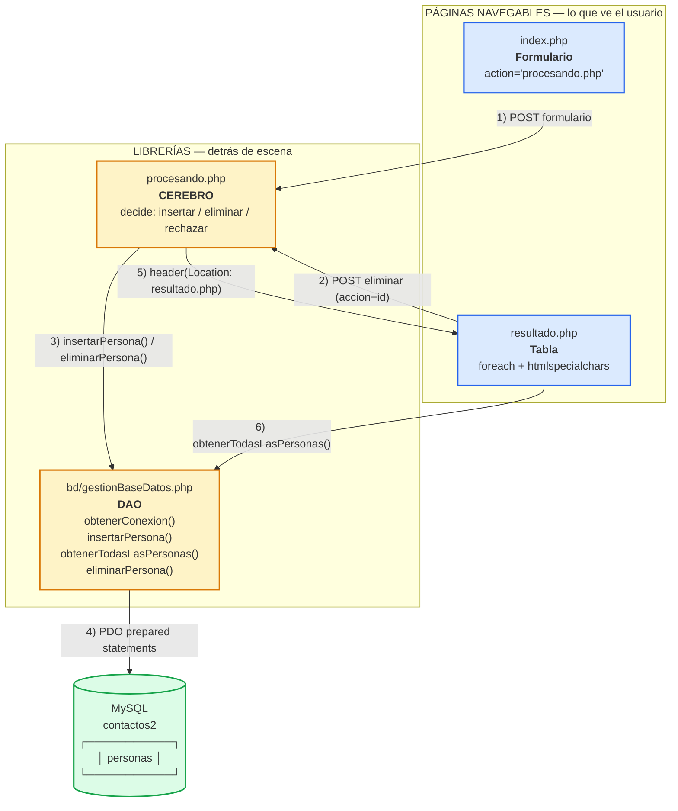
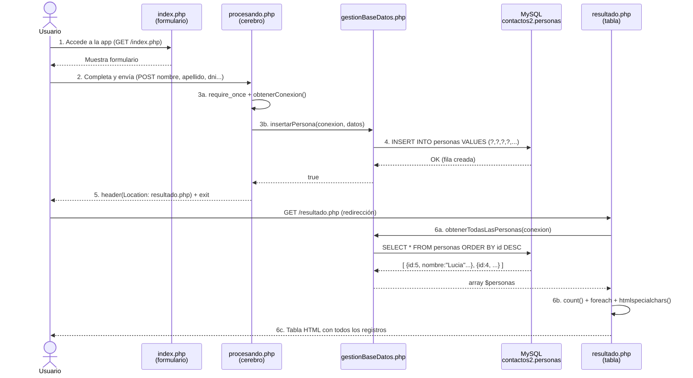
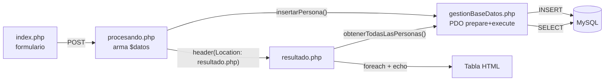
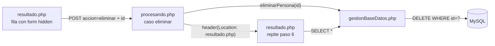
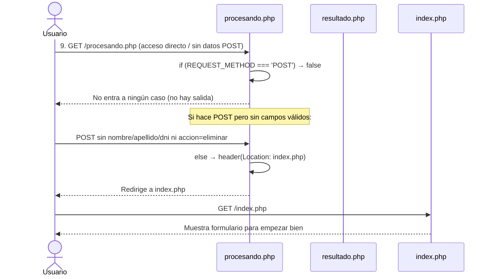
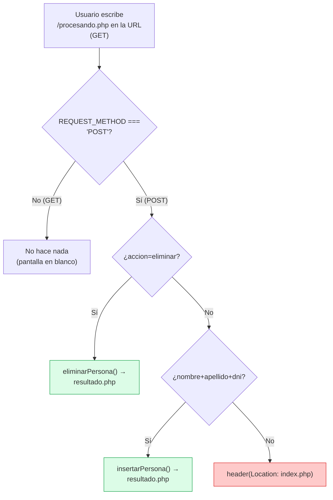

# Resumen Visual de Recorridos — `etapa2-BD`

> **Objetivo:** ver de un vistazo toda la app, qué archivos son páginas y cuáles son librerías, y seguir los 3 recorridos posibles con código real.

---

## 1. Arquitectura general

### 1.1 ¿Qué ve el usuario y qué no?


| Tipo                           | Archivos                                    | ¿Se abre en el navegador? | ¿Tiene HTML?    | Rol                                          |
| -------------------------------- | --------------------------------------------- | ---------------------------- | ------------------ | ---------------------------------------------- |
| **Páginas navegables**        | `index.php`, `resultado.php`                | Sí                        | Sí (HTML + PHP) | Lo que el usuario ve y navega                |
| **Librerías (no navegables)** | `procesando.php`, `bd/gestionBaseDatos.php` | No (trabajan detrás)      | No, solo PHP     | Procesan y hablan con la BD                  |
| **Recurso**                    | `bd/script.sql`                             | No                         | SQL              | Plano para crear BD/tabla (se ejecuta 1 vez) |
| **Base de datos**              | MySQL`contactos2` / tabla `personas`        | No                         | —               | Guarda los datos de forma permanente         |

> **Regla de oro:** el usuario solo navega entre `index.php` ↔ `resultado.php`. Nunca debería "aterrizar" en `procesando.php`.

### 1.2 Diagrama de bloques

Si tu visor soporta Mermaid (GitHub / VS Code / Obsidian) verás el gráfico. Si no, usa el ASCII de abajo.



**Versión ASCII (si Mermaid no se renderiza):**

```
 ┌─────────────────────────────────┐        ┌──────────────────────────────────┐
 │   PÁGINAS NAVEGABLES (usuario)  │        │     LIBRERÍAS (detrás de escena) │
 │                                 │        │                                  │
 │  ┌──────────────┐  ┌───────────┐│        │ ┌────────────┐  ┌──────────────┐ │
 │  │  index.php   │  │resultado  ││        │ │procesando  │  │gestionBase   │ │
 │  │  Formulario  │  │  .php     ││        │ │  .php      │  │Datos.php     │ │
 │  │              │  │  Tabla    ││        │ │  CEREBRO   │  │  (DAO)       │ │
 │  └──────┬───────┘  └─────▲─────┘│        │ └─────┬──────┘  └──────┬───────┘ │
 │         │                │      │        │       │                │         │
 └─────────┼────────────────┼──────┘        └───────┼────────────────┼─────────┘
           │ POST           │ header                │  PDO           │
           │ formulario     │ Location              │  prepare()     │ SQL
           └────────────────┼───────────────────────┘  execute()     │
                            │                          │             ▼
                            └──────────────────────────┼────►  ┌──────────┐
                                                       │       │  MySQL   │
                                                       └──────►│contactos2│
                                                               │ personas │
                                                               └──────────┘

  El usuario SOLO navega:  index.php  ──POST──►  (procesando)  ──redirect──►  resultado.php
                                      resultado.php ──POST eliminar──► (procesando) ──redirect──► resultado.php
```

### 1.3 Mapa de comunicaciones

```
index.php            ──POST──►  procesando.php  ──llama──►  gestionBaseDatos.php  ──PDO──► MySQL
resultado.php        ──POST──►  procesando.php  ──llama──►  gestionBaseDatos.php  ──PDO──► MySQL
resultado.php        ──require──► gestionBaseDatos.php ──PDO──► MySQL (lectura directa, sin pasar por procesando)
```

> `procesando.php` está **en el medio** entre `index.php` y `resultado.php` y es el único que decide qué hacer. `gestionBaseDatos.php` es la única que habla con MySQL.

---

## 2. Los 3 recorridos posibles

### Vista rápida (cheat-sheet)

```
NAVEGACIÓN 1 — Principal (alta + listado)     Pasos 1 → 6
NAVEGACIÓN 2 — Eliminación                     Pasos 7 → 8 (= repite paso 6)
NAVEGACIÓN 3 — Acceso incorrecto / directo     Paso  9 → vuelve a index.php
```

---

## 3. Navegación 1 — Principal: cargar y ver

> Flujo feliz: el usuario entra, carga una persona y ve la tabla actualizada.



#### Paso a paso con código

**Paso 1 — Accedo a la app, me aparece el formulario (`index.php`)**

Es una página HTML. El detalle clave es el `<form>`:

```html
<!-- index.php, línea 39 -->
<form action="procesando.php" method="POST">
    <input type="text" name="nombre" required>
    <input type="text" name="apellido" required>
    <input type="text" name="dni" required>
    <!-- ... resto de campos ... -->
    <button type="submit">Enviar</button>
</form>
<a href="resultado.php" class="btn btn-secondary">Ver Personas</a>
```

* `action="procesando.php"` → los datos **no** van directo a `resultado.php` (como en etapa 1). Primero deben guardarse en MySQL.
* `method="POST"` → los datos viajan ocultos en el cuerpo del pedido HTTP.
* `name="nombre"` → es la clave que luego se lee como `$_POST['nombre']`.

**Paso 2 — Completo el formulario y lo envío**

El navegador arma un POST con todos los `name` → valor. Ejemplo: `nombre=Juan&apellido=Perez&dni=40123456...`

**Paso 3 — (no lo vemos) `procesando.php` toma ese formulario y lo deriva**

```php
// procesando.php, líneas 18-24
require_once 'bd/gestionBaseDatos.php';   // trae obtenerConexion(), insertarPersona(), etc.
$conexion = obtenerConexion();            // conecta a MySQL (ver paso 4)

if ($_SERVER['REQUEST_METHOD'] === 'POST') {

    // Caso INSERTAR: llegaron los campos obligatorios
    } else if (isset($_POST['nombre']) && isset($_POST['apellido']) && isset($_POST['dni'])) {

        $datos = [
            'nombre'           => trim($_POST['nombre']),
            'apellido'         => trim($_POST['apellido']),
            'dni'              => trim($_POST['dni']),
            'cuit'             => trim($_POST['cuit']),
            'fecha_nacimiento' => $_POST['fecha_nacimiento'],
            'email'            => trim($_POST['email']),
            'telefono'         => trim($_POST['telefono']),
            'direccion'        => trim($_POST['direccion']),
            'ciudad'           => trim($_POST['ciudad']),
            'provincia'        => trim($_POST['provincia']),
            'codigo_postal'    => trim($_POST['codigo_postal']),
            'observaciones'    => trim($_POST['observaciones']),
        ];

        insertarPersona($conexion, $datos);   // delega a gestionBaseDatos.php
        header("Location: resultado.php");    // paso 5
        exit;
    }
}
```

* `require_once` = "copiar y pegar" las funciones de `gestionBaseDatos.php`.
* `$_SERVER['REQUEST_METHOD'] === 'POST'` verifica que vino de un formulario.
* `isset()` + `trim()` validan y limpian.
* Array asociativo `$datos` agrupa todo con claves iguales a las columnas.

**Paso 4 — `gestionBaseDatos.php` inserta en la tabla `personas`**

```php
// bd/gestionBaseDatos.php — obtenerConexion()
function obtenerConexion() {    // Datos de conexion a MySQL - CAMBIAR segun tu instalacion
    $host = "localhost";       // Servidor (generalmente localhost)
    $usuario = "root";         // Usuario de MySQL
    $contrasena = "";          // Contrasena de MySQL (vacio por defecto en XAMPP)
    $baseDatos = "contactos2"; // Nombre de la base de datos (debe coincidir con script.sql)
    // ...
    $conexion = new PDO("mysql:host=$host;dbname=$baseDatos;charset=utf8mb4", $usuario, $contrasena);
    $conexion->setAttribute(PDO::ATTR_ERRMODE, PDO::ERRMODE_EXCEPTION);
    return $conexion;
}
```

```php
// bd/gestionBaseDatos.php — insertarPersona()
function insertarPersona($conexion, $datos) {
    $sql = "INSERT INTO personas (nombre, apellido, dni, cuit, fecha_nacimiento, email, telefono, direccion, ciudad, provincia, codigo_postal, observaciones)
            VALUES (?, ?, ?, ?, ?, ?, ?, ?, ?, ?, ?, ?)";

    $stmt = $conexion->prepare($sql);          // 1. Prepara (analiza sin ejecutar)
    $resultado = $stmt->execute([              // 2. Ejecuta pasando valores separados
        $datos['nombre'],
        $datos['apellido'],
        // ... resto en el mismo orden que los ?
        $datos['observaciones']
    ]);
    return $resultado;
}
```

* `PDO` + `?` + `execute()` = **prepared statements** → protege contra **inyección SQL**. Si alguien envía `dni = 123' OR '1'='1`, no se concatena en el SQL, se envía como dato seguro.
* El orden de los `?` debe coincidir exactamente con el orden del array de `execute()`.

Crea la BD/tabla una sola vez con:

```sql
-- bd/script.sql
CREATE DATABASE IF NOT EXISTS contactos2;
USE contactos2;

CREATE TABLE IF NOT EXISTS personas (
    id INT AUTO_INCREMENT PRIMARY KEY,
    nombre VARCHAR(100) NOT NULL,
    -- ... resto de columnas ...
    observaciones TEXT
);
```

**Paso 5 — `procesando.php` redirige a `resultado.php`**

```php
header("Location: resultado.php");
exit;   // SIEMPRE después de header()
```

* El navegador recibe una orden de redirección y hace un `GET` a `resultado.php`.
* `exit` corta el script para que no siga ejecutando.

**Paso 6 — `resultado.php` pide todos los registros y los muestra**

```php
// resultado.php, líneas 9-17 (arriba del HTML, antes de <html>)
require_once 'bd/gestionBaseDatos.php';
$conexion = obtenerConexion();
$personas = obtenerTodasLasPersonas($conexion);
// $personas = [
//   0 => ['id'=>5, 'nombre'=>'Lucia', 'apellido'=>'Perez', ...],
//   1 => ['id'=>4, 'nombre'=>'Juan', ...],
// ]
```

```php
// bd/gestionBaseDatos.php — obtenerTodasLasPersonas()
function obtenerTodasLasPersonas($conexion) {
    $sql = "SELECT * FROM personas ORDER BY id DESC";  // más nuevos primero
    $stmt = $conexion->prepare($sql);
    $stmt->execute();
    return $stmt->fetchAll(PDO::FETCH_ASSOC);           // array de arrays asociativos
}
```

```html
<!-- resultado.php, dentro del HTML -->
<span class="badge"><?php echo count($personas); ?> registros</span>

<?php if (empty($personas)): ?>
    <div class="alert alert-info">No hay personas registradas aun.</div>
<?php else: ?>
    <table>
        <?php foreach ($personas as $persona): ?>
            <tr>
                <td><?php echo $persona['id']; ?></td>
                <td><?php echo htmlspecialchars($persona['nombre']); ?></td>
                <td><?php echo htmlspecialchars($persona['apellido']); ?></td>
                <!-- ... -->
                <td>
                    <!-- ver Navegación 2 -->
                </td>
            </tr>
        <?php endforeach; ?>
    </table>
<?php endif; ?>
```

* `count($personas)` cuenta registros.
* `empty()` verifica si no hay datos.
* `foreach` recorre cada persona.
* `htmlspecialchars()` evita **XSS**: si alguien guardó `<script>alert('hack')</script>` como nombre, se muestra como texto, no se ejecuta.



---

## 4. Navegación 2 — Eliminación

> Desde el listado, cada fila tiene su botón "Eliminar".

```mermaid
sequenceDiagram
    actor U as Usuario
    participant R as resultado.php
    participant P as procesando.php
    participant G as gestionBaseDatos.php
    participant BD as MySQL

    U->>R: Ve la tabla (paso 6 anterior)
    R-->>U: Cada fila tiene <form> Eliminar
    U->>P: 7. Click "Eliminar" → POST accion=eliminar, id=5
    P->>P: Detecta $_POST['accion']==='eliminar'
    P->>G: eliminarPersona(conexion, 5)
    G->>BD: 7. DELETE FROM personas WHERE id = ?
    BD-->>G: OK (fila borrada)
    P-->>U: header(Location: resultado.php) + exit
    U->>R: GET /resultado.php
    R->>G: 8. obtenerTodasLasPersonas() (= paso 6)
    G->>BD: SELECT * FROM personas ORDER BY id DESC
    R-->>U: Tabla actualizada (sin la fila eliminada)
```



#### Paso a paso con código

**Paso 7 — En el listado, por cada persona hay un "Eliminar"**

```html
<!-- resultado.php, líneas 97-102 — dentro del foreach -->
<form action="procesando.php" method="POST"
      onsubmit="return confirm('Seguro que deseas eliminar esta persona?');">
    <input type="hidden" name="accion" value="eliminar">
    <input type="hidden" name="id" value="<?php echo $persona['id']; ?>">
    <button type="submit" class="btn btn-danger btn-sm">Eliminar</button>
</form>
```

* `type="hidden"` → campos invisibles pero viajan en el POST.
* `accion=eliminar` le dice a `procesando.php` qué caso es.
* `id` identifica qué fila borrar (viene de `$persona['id']`).
* `onsubmit="confirm(...)"` pide confirmación con JavaScript antes de enviar.

```php
// procesando.php, líneas 29-37 — Caso 1: ELIMINAR
if (isset($_POST['accion']) && $_POST['accion'] === 'eliminar') {
    $id = (int) $_POST['id'];              // (int) fuerza a número
    eliminarPersona($conexion, $id);       // delega
    header("Location: resultado.php");
    exit;
}
```

```php
// bd/gestionBaseDatos.php — eliminarPersona()
function eliminarPersona($conexion, $id) {
    $sql = "DELETE FROM personas WHERE id = ?";
    $stmt = $conexion->prepare($sql);
    $resultado = $stmt->execute([$id]);    // el ? se reemplaza por $id de forma segura
    return $resultado;
}
```

**Paso 8 — Se repite el paso 6**

Después del `header("Location: resultado.php")`, `resultado.php` vuelve a ejecutar:

```php
$personas = obtenerTodasLasPersonas($conexion);
// ... foreach + tabla ...
```

Por eso la tabla ya no muestra la persona eliminada — es una lectura fresca de MySQL.



---

## 5. Navegación 3 — Acceso incorrecto / directo

> ¿Qué pasa si alguien abre `procesando.php` directo en el navegador sin pasar por un formulario?



```php
// procesando.php, líneas 24 y 66-71
if ($_SERVER['REQUEST_METHOD'] === 'POST') {

    if (isset($_POST['accion']) && $_POST['accion'] === 'eliminar') {
        // caso eliminar
    } else if (isset($_POST['nombre']) && isset($_POST['apellido']) && isset($_POST['dni'])) {
        // caso insertar
    } else {
        // 9. No vino ni eliminar ni datos mínimos → acceso incorrecto
        header("Location: index.php");
        exit;
    }
}
// Si el método es GET (acceso directo por URL), ni siquiera entra al if
// El archivo termina sin mostrar nada — el navegador queda en blanco.
// Por eso el else del POST redirige a index.php: es la "puerta de entrada" correcta.
```

**Idea clave:** `procesando.php` es una librería, no una página. Si no viene de `index.php` (insertar) ni de `resultado.php` (eliminar), no tiene qué hacer y te manda al inicio. Es un **guardia** que valida el origen.



---

## 6. Resumen de comunicaciones (para memorizar)


| ¿Quién llama a quién?                   | Función / mecanismo                                          | ¿Para qué?                    |
| -------------------------------------------- | --------------------------------------------------------------- | --------------------------------- |
| `index.php` → `procesando.php`            | `<form action="procesando.php" method="POST">`                | Enviar datos del formulario     |
| `resultado.php` → `procesando.php`        | `<form action="procesando.php">` con `hidden accion=eliminar` | Pedir borrado de una fila       |
| `procesando.php` → `gestionBaseDatos.php` | `require_once` + `obtenerConexion()`                          | Traer funciones y conectar PDO  |
| `procesando.php` → `gestionBaseDatos.php` | `insertarPersona($conexion, $datos)`                          | INSERT preparado                |
| `procesando.php` → `gestionBaseDatos.php` | `eliminarPersona($conexion, $id)`                             | DELETE preparado                |
| `resultado.php` → `gestionBaseDatos.php`  | `obtenerTodasLasPersonas($conexion)`                          | SELECT de todo                  |
| `gestionBaseDatos.php` → MySQL            | `new PDO(...)` + `prepare()` + `execute()`                    | Hablar con`contactos2.personas` |
| `procesando.php` → navegador              | `header("Location: ...") + exit`                              | Redirigir (PRG pattern)         |

> **Patrón PRG (Post/Redirect/Get):** después de un POST que modifica la BD, nunca muestres HTML directo. Redirige con `header()` a una página GET (`resultado.php`). Así evitas re-envíos al recargar.

---

## 7. Chuleta de código por etapa (copiar/pegar para repasar)

**Crear la BD (1 vez en phpMyAdmin → pestaña SQL):**

```sql
CREATE DATABASE IF NOT EXISTS contactos2;
USE contactos2;
CREATE TABLE IF NOT EXISTS personas (
    id INT AUTO_INCREMENT PRIMARY KEY,
    nombre VARCHAR(100) NOT NULL,
    apellido VARCHAR(100) NOT NULL,
    dni VARCHAR(20) NOT NULL,
    cuit VARCHAR(20) NOT NULL,
    fecha_nacimiento DATE NOT NULL,
    email VARCHAR(150) NOT NULL,
    telefono VARCHAR(30) NOT NULL,
    direccion VARCHAR(200) NOT NULL,
    ciudad VARCHAR(100) NOT NULL,
    provincia VARCHAR(100) NOT NULL,
    codigo_postal VARCHAR(10) NOT NULL,
    observaciones TEXT
);
```

**Conexión (cambiar según tu XAMPP):**

```php
function obtenerConexion() {    // Datos de conexion a MySQL - CAMBIAR segun tu instalacion
    $host = "localhost";       // Servidor (generalmente localhost)
    $usuario = "root";         // Usuario de MySQL
    $contrasena = "";          // Contrasena de MySQL (vacio por defecto en XAMPP)
    $baseDatos = "contactos2"; // Nombre de la base de datos (debe coincidir con script.sql)
    return new PDO("mysql:host=$host;dbname=$baseDatos;charset=utf8mb4", $usuario, $contrasena);
}
```

**Enviar formulario / Eliminar / Mostrar:**

```php
// Enviar (index.php)
<form action="procesando.php" method="POST">

// Eliminar (resultado.php)
<form action="procesando.php" method="POST">
    <input type="hidden" name="accion" value="eliminar">
    <input type="hidden" name="id" value="<?php echo $persona['id']; ?>">

// Mostrar (resultado.php)
<?php foreach ($personas as $persona): ?>
    <td><?php echo htmlspecialchars($persona['nombre']); ?></td>
<?php endforeach; ?>
```

---

## 8. Para llevar a clase (preguntas disparadoras)

1. ¿Por qué `procesando.php` no tiene `<html>` y por qué nunca lo navegamos?
2. ¿Qué pasa si en `gestionBaseDatos.php` ponen `$baseDatos = "contactos"` pero el SQL creó `contactos2`?
3. ¿Qué protege `?` + `execute()` vs concatenar `"$dni"` directo en el SQL?
4. ¿Por qué `resultado.php` usa `htmlspecialchars()` y `procesando.php` usa `(int)` y `trim()`?
5. ¿Qué ven en el navegador si abren `procesando.php` sin POST? ¿Y con POST sin datos?

> Ver también: `analisisEstudiantes.md` (guía completa con explicación línea por línea).
